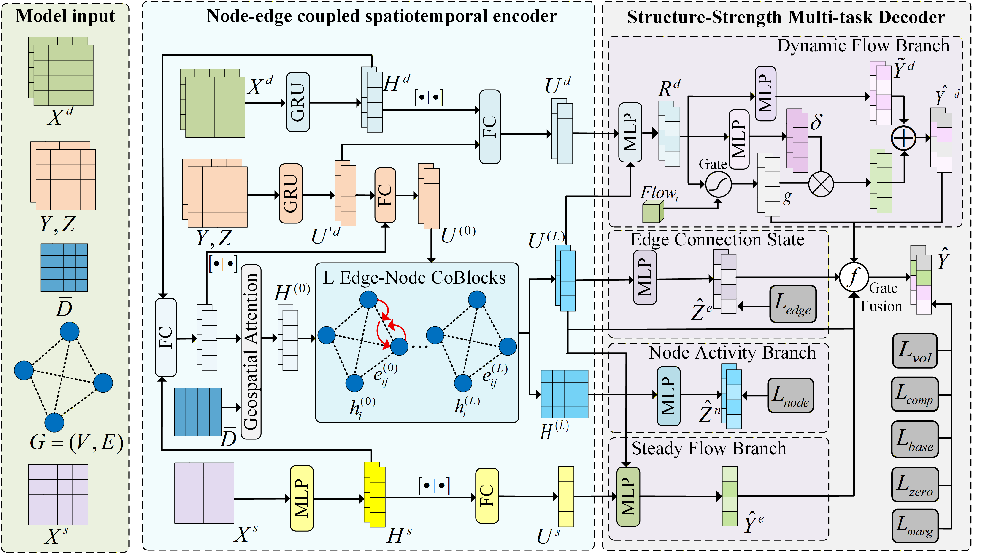

# SAGMTL: Structure-Aware Graph Multi-Task Learning for Dynamic Sparse OD Demand Prediction

This repository provides the official implementation of **SAGMTL**, a structure-aware graph multi-task learning framework for dynamic sparse origin-destination (OD) demand prediction.

SAGMTL is designed to jointly model OD flow intensity and sparse structural states in urban mobility systems. It decomposes dynamic sparse OD demand prediction into multiple coupled tasks, including OD flow prediction, OD edge connection state prediction, and node activity prediction. The model learns node-edge coupled spatiotemporal representations and uses a structure-strength multi-task decoder to improve prediction robustness under sparse, intermittent, and long-tailed OD interaction patterns.

## 1. Framework Overview


SAGMTL consists of three main components.

### 1.1 Node-edge coupled spatiotemporal encoder

The encoder integrates historical OD observations, edge activation states, static regional attributes, and spatial relationships to learn unified node-edge representations. It combines temporal dynamic encoding, spatial attention, edge-history representation, and node-edge collaborative updating.

### 1.2 Structure-strength multi-task decoder

The decoder contains four branches:

- steady flow branch;
- dynamic flow branch;
- edge connection state branch;
- node activity branch.

The steady flow branch models stable OD demand patterns, while the dynamic flow branch captures short-term residual variations. The edge connection state branch predicts whether each OD edge is active, and the node activity branch estimates whether each region is active as an origin or destination.

### 1.3 Joint optimization module

SAGMTL jointly optimizes flow regression, edge-level structural supervision, node-level structural supervision, zero-flow suppression, volatility consistency, and marginal consistency. This design improves sparse OD prediction by simultaneously considering flow intensity and structural activity states.

## 2. Repository Structure

The main code structure is:

```text
SAGMTL/
  config.py
  train.py
  model/
    __init__.py
    coblock.py
    decoder.py
    encoder.py
    model.py
  utils/
    __init__.py
    data_utils.py
    eval_utils.py
    loss_utils.py
README.md
````

## 3. Dataset

The processed datasets used in this study are available on IEEE DataPort:

**Processed Multi-City Dynamic Sparse Origin-Destination Demand Dataset for SAGMTL**

DOI:

```text
10.21227/sg4n-6t97
```

The dataset contains processed OD demand data for three cities:

```text
Beijing
Chengdu
Nanjing
```

The data are aggregated at a 20-minute temporal resolution. Raw GPS trajectories and personally identifiable information are not included.

## 4. Dataset Organization

After downloading the dataset, organize the data as follows:

```text
OD_output_multi/
  Beijing/
    gps2poi_diag.json
    grid_id_mapping.json
    node_activity_20min.csv.gz
    node_feature_names.json
    node_features.npy
    od_edges_20min.csv
    POI_grid_result.csv
    POI_grid_result.geojson
    POI_points_clean.csv
    spatial_dist.meta.json
    spatial_dist.npy
    time_weights.json
    used_boundary.geojson

  Chengdu/
    gps2poi_diag.json
    grid_id_mapping.json
    node_activity_20min.csv.gz
    node_feature_names.json
    node_features.npy
    od_edges_20min.csv
    POI_grid_result.csv
    POI_grid_result.geojson
    POI_points_clean.csv
    spatial_dist.meta.json
    spatial_dist.npy
    time_weights.json
    used_boundary.geojson

  Nanjing/
    gps2poi_diag.json
    grid_id_mapping.json
    node_activity_20min.csv.gz
    node_feature_names.json
    node_features.npy
    od_edges_20min.csv
    POI_grid_result.csv
    POI_grid_result.geojson
    POI_points_clean.csv
    spatial_dist.meta.json
    spatial_dist.npy
    time_weights.json
    used_boundary.geojson
```

In the training commands, replace `/path/to/OD_output_multi/Beijing` with the actual path to the corresponding city folder.

## 5. Environment

The code is implemented in Python and PyTorch.

Recommended environment:

```text
Python >= 3.9
PyTorch >= 2.0
NumPy
Pandas
scikit-learn
tqdm
matplotlib
```

Install basic dependencies using:

```bash
pip install numpy pandas scikit-learn tqdm matplotlib
```

Install PyTorch according to your CUDA version from the official PyTorch website.

A minimal `requirements.txt` can be written as:

```text
numpy
pandas
scikit-learn
tqdm
matplotlib
torch
```

## 6. Training

Before running the training script, enter the code directory:

```bash
cd SAGMTL
```

### 6.1 Reproducing the Beijing result

The following command corresponds to the main Beijing configuration used to reproduce the reported SAGMTL result around:

```text
MAE = 0.8692
RMSE = 1.4505
MAPE = 39.2874
```

Run:

```bash
python train.py \
  --gpu 0 \
  --device cuda \
  --od_root /path/to/OD_output_multi/Beijing \
  --save_dir runs \
  --exp_name sagmtl_beijing_reproduce_086_co_noHistDec \
  --T_in 18 \
  --time_dim 64 \
  --step_ahead 1 \
  --horizon 6 \
  --hidden_dim 96 \
  --edge_dim 128 \
  --role_dim 96 \
  --edge_chunk_size 4096 \
  --num_co_layers 2 \
  --co_channels 4 \
  --co_dropout 0.1 \
  --enc_dropout 0.1 \
  --use_edge_history 1 \
  --edge_history_input flow_exist \
  --edge_history_dim 96 \
  --edge_history_chunk_size 4096 \
  --edge_history_fuse concat \
  --use_time_dyn 1 \
  --use_static_node 1 \
  --use_spatial_attn 1 \
  --spatial_attn_heads 4 \
  --spatial_attn_res_weight 0.15 \
  --use_spatial_dist_decay 1 \
  --spatial_dist_decay_init 0.1 \
  --spatial_dist_norm max \
  --use_gate1 1 \
  --use_last_flow_gate 1 \
  --use_sd_gate 1 \
  --use_od_gate 1 \
  --use_pv_multiply 0 \
  --use_ar_od 0 \
  --use_ar_dyn 0 \
  --use_edge_history_in_decoder 0 \
  --static_branch_mode co \
  --sd_fusion_mode adaptive \
  --dyn_decoder_mode residual \
  --dyn_res_use_tanh 1 \
  --dyn_res_scale 1.0 \
  --w_base 1.0 \
  --lambda_base 3.0 \
  --lambda_comp 1.0 \
  --comp_weight_mode legacy \
  --flow_loss_space log1p \
  --flow_loss_type smoothl1 \
  --w_cons 0.1 \
  --w_node 0.08 \
  --w_edge 0.08 \
  --w_vol 0.1 \
  --w_zero 0.035 \
  --edge_loss_type focal \
  --edge_alpha 0.75 \
  --edge_gamma 2.0 \
  --transition_boost 2.0 \
  --use_transition_weight 1 \
  --zero_top_ratio 0.01 \
  --zero_min_topk 64 \
  --zero_max_topk 2048 \
  --aux_warmup_epochs 15 \
  --cons_warmup_epochs 10 \
  --structure_pretrain_epochs 5 \
  --reg_warmup_epochs 8 \
  --patience 35 \
  --epochs 80 \
  --batch_size 1 \
  --lr 1e-3 \
  --weight_decay 1e-5 \
  --grad_clip 5.0 \
  --seed 42
```


### 6.2 Training on Chengdu or Nanjing

For Chengdu or Nanjing, replace `--od_root` and `--exp_name` in the above command. For example:

```bash
python train.py \
  --gpu 0 \
  --device cuda \
  --od_root /path/to/OD_output_multi/Chengdu \
  --save_dir runs \
  --exp_name sagmtl_chengdu \
  --T_in 18 \
  --time_dim 64 \
  --step_ahead 1 \
  --horizon 6 \
  --hidden_dim 96 \
  --edge_dim 128 \
  --role_dim 96 \
  --edge_chunk_size 4096 \
  --num_co_layers 2 \
  --co_channels 4 \
  --use_edge_history 1 \
  --edge_history_input flow_exist \
  --edge_history_dim 96 \
  --edge_history_chunk_size 4096 \
  --edge_history_fuse concat \
  --use_time_dyn 1 \
  --use_static_node 1 \
  --use_spatial_attn 1 \
  --spatial_attn_heads 4 \
  --spatial_attn_res_weight 0.15 \
  --use_spatial_dist_decay 1 \
  --spatial_dist_decay_init 0.1 \
  --spatial_dist_norm max \
  --use_gate1 1 \
  --use_last_flow_gate 1 \
  --use_sd_gate 1 \
  --use_od_gate 1 \
  --use_pv_multiply 0 \
  --use_ar_od 0 \
  --use_ar_dyn 0 \
  --use_edge_history_in_decoder 0 \
  --static_branch_mode co \
  --sd_fusion_mode adaptive \
  --dyn_decoder_mode residual \
  --dyn_res_use_tanh 1 \
  --dyn_res_scale 1.0 \
  --w_base 1.0 \
  --lambda_base 3.0 \
  --lambda_comp 1.0 \
  --comp_weight_mode legacy \
  --flow_loss_space log1p \
  --flow_loss_type smoothl1 \
  --w_cons 0.1 \
  --w_node 0.08 \
  --w_edge 0.08 \
  --w_vol 0.1 \
  --w_zero 0.035 \
  --edge_loss_type focal \
  --edge_alpha 0.75 \
  --edge_gamma 2.0 \
  --transition_boost 2.0 \
  --use_transition_weight 1 \
  --zero_top_ratio 0.01 \
  --zero_min_topk 64 \
  --zero_max_topk 2048 \
  --aux_warmup_epochs 15 \
  --cons_warmup_epochs 10 \
  --structure_pretrain_epochs 5 \
  --reg_warmup_epochs 8 \
  --patience 35 \
  --epochs 80 \
  --batch_size 1 \
  --lr 1e-3 \
  --weight_decay 1e-5 \
  --grad_clip 5.0 \
  --seed 42
```

For Nanjing, change:

```text
--od_root /path/to/OD_output_multi/Nanjing
--exp_name sagmtl_nanjing
```

## 7. Evaluation Metrics

The model is evaluated using the following metrics:

```text
MAE
RMSE
MAPE
All-edge MAE
Node F1
Edge F1
Edge AUC
```

The primary OD flow prediction metrics are computed on active OD edges. All-edge MAE is used to evaluate global prediction behavior over the full OD edge space, especially under sparse OD distributions.

## 8. Output Files

Each training run creates an experiment directory under `save_dir`, for example:

```text
runs/sagmtl_beijing/
```

The output directory may contain:

```text
best_model.pt
checkpoint.pt
train.log
metrics_val.json
metrics_test.json
prediction outputs
```

The exact output file names may depend on the current version of the training script.

## 9. Notes on Reproducibility

Due to GPU type, CUDA version, PyTorch version, and random initialization, slight numerical differences may occur across different environments. To improve reproducibility, it is recommended to:

1. use the same dataset split;
2. keep the same hyperparameter configuration;
3. keep `batch_size = 1`;
4. use `edge_chunk_size = 4096` for Beijing;
5. ensure sufficient disk space for checkpoint saving;
6. record the random seed and training log.

If training stops unexpectedly with an error such as:

```text
No space left on device
```

please clear old checkpoints or change `save_dir` to a disk with sufficient space.

## 10. Citation

If you use this code or dataset, please cite the corresponding paper and dataset.

Dataset:

```text
Processed Multi-City Dynamic Sparse Origin-Destination Demand Dataset for SAGMTL
IEEE DataPort
DOI: 10.21227/sg4n-6t97
```

Paper:

```text

```


```
```
